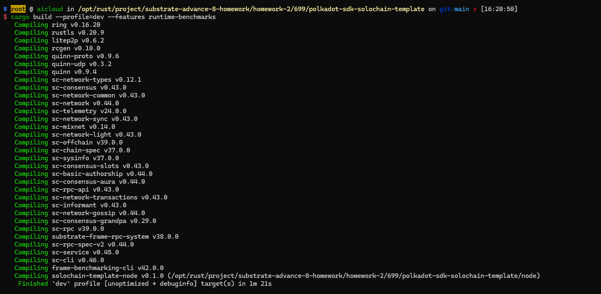

## 编译

```bash
cd polkadot-sdk-solochain-template/
# cargo build --profile=release --features runtime-benchmarks
cargo build --profile=dev --features runtime-benchmarks

```

## 运行 benchmark
```bash
# download frame-weight-template.hbs [polkadot-sdk repo](https://github.com/paritytech/polkadot-sdk/blob/master/substrate/.maintain/frame-weight-template.hbs).

./target/debug/solochain-template-node benchmark pallet \
--chain dev \
--execution=wasm \
--wasm-execution=compiled \
--pallet pallet_poe \
--extrinsic "*" \
--steps 20 \
--repeat 10 \
--output pallets/poe/src/weights.rs \
--template .maintain/frame-weight-template.hbs

cargo test --package pallet-poe --features runtime-benchmarks
```

## 结果



